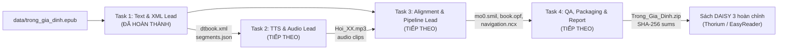

# HƯỚNG DẪN DÀNH CHO AI AGENT CODING & DEVELOPER
## Dự án: Sách Điện Tử DAISY 3 - Bộ Môn Xử Lý Tiếng Nói (K35)
## Tác phẩm: *Trong Gia Đình* (Hector Malot) | ISBN: `978-604-69-8175-6`

Tài liệu này quy định các tiêu chuẩn kiến trúc, quy tắc viết code, giao thức chuyển giao dữ liệu (handoff) và quy trình cập nhật trạng thái dành cho các **AI Coding Agent** (Antigravity, Cursor, Windsurf, Claude Code...) và thành viên phát triển tiếp theo của dự án.

---

## 1. Bối Cảnh Dự Án & Bản Đồ Nhiệm Vụ (Project Roadmap)

Dự án gồm **4 nhiệm vụ chính liên kết tuần tự** theo đường ống (pipeline):



### Bảng Trạng Thái Nhiệm Vụ:
* **Task 1 (Text & XML):** `[COMPLETED]` - Đã trích xuất và chuẩn hóa 23 chương, tạo `dtbook.xml` chuẩn DTBook 2005-3 và `segments.json`.
* **Task 2 (TTS & Giọng đọc):** `[PENDING / NEXT]` - Sinh giọng đọc MP3 từ `segments.json` bằng SSML và mô hình TTS tiếng Việt.
* **Task 3 (Đồng bộ SMIL & Đóng gói DAISY):** `[PENDING / NEXT]` - Tạo `mo0.smil`, `book.opf`, `navigation.ncx`, `resources.res`.
* **Task 4 (Kiểm thử & Báo cáo):** `[PENDING / NEXT]` - Kiểm thử hiển thị chữ chạy trên Thorium Reader, nén zip và tạo mã băm SHA-256.

---

## 2. Quy Tắc Tổ Chức Thư Mục & Quản Lý Dữ Liệu

Tất cả các Agent **bắt buộc tuân thủ** cấu trúc phân tách rõ ràng:

```text
.
├── agent.md                # Quy chuẩn dành cho AI Agent Coding (tệp này)
├── README.md               # Bộ mặt dự án: Tổng quan, bảng phân công và trạng thái
├── .gitignore              # Tuyệt đối không commit cache, virtualenv, tệp tạm
├── data/                   # Chứa tài liệu nguồn nguyên bản (Read-only)
│   └── trong_gia_dinh.epub
├── src/                    # Toàn bộ mã nguồn Python thực thi
│   ├── config.py           # Khai báo biến toàn cục, metadata, đường dẫn chung
│   ├── extract_clean.py    # (Task 1)
│   ├── generate_dtbook.py  # (Task 1)
│   ├── validate_dtbook.py  # (Task 1)
│   ├── run_task1.py        # (Task 1) Runner
│   ├── tts/                # (Dành cho Task 2) Module tổng hợp tiếng nói
│   ├── alignment/          # (Dành cho Task 3) Module căn chỉnh thời gian & SMIL
│   └── packaging/          # (Dành cho Task 4) Module đóng gói zip & sha256
└── results/                # Kết quả đầu ra theo từng Task riêng biệt
    ├── task1/              # Kết quả Task 1: 23 chương (dtbook.xml, segments.json)
    ├── task2/              # Kết quả Task 2: Audio (.mp3) và timestamp chi tiết
    ├── task3/              # Kết quả Task 3: Bộ file DAISY 3 (.smil, .opf, .ncx)
    └── task4/              # Kết quả Task 4: Gói nén nộp bài và checksums
```

> [!IMPORTANT]
> **Nguyên tắc bất di bất dịch về đường dẫn:**
> * Tuyệt đối **không hardcode** đường dẫn tuyệt đối dạng `/Users/...` trong code.
> * Luôn kế thừa đường dẫn gốc từ [`src/config.py`](file:///Users/admin/Documents/master/XLTN/src/config.py) qua `BASE_DIR = os.path.dirname(...)`.

---

## 3. Quy Chuẩn Giao Thức Dữ Liệu Giữa Các Task (Handoff Protocol)

### 3.1. Dành cho Agent thực hiện Task 2 (TTS & Audio Lead)
* **Dữ liệu đầu vào:** Đọc trực tiếp từ `results/task1/Trong_Gia_Dinh-Chuong_XX/segments.json`.
* **Cấu trúc mỗi segment:**
  ```json
  {
    "sent_id": "id_4",
    "smil_sid": "sid_4",
    "p_id": "c0_p1",
    "seq_id": "seq_1",
    "text": "Hector Malot (Hécto Malo) sinh năm 1830 ở miền Bắc nước Pháp."
  }
  ```
* **Nhiệm vụ của Task 2:**
  1. Sử dụng công cụ TTS tiếng Việt chất lượng cao (ưu tiên Edge-TTS: `vi-VN-HoaiMyNeural` hoặc `vi-VN-NamMinhNeural`).
  2. Ứng dụng **SSML** để chỉnh sửa phát âm các từ phiên âm Pháp trong ngoặc đơn (ví dụ: `Hécto Malo`, `Bécxi`, `Pari`, `Palica`, `Marôcua`, `Vunphran`).
  3. Xuất file âm thanh vào `results/task2/` hoặc phân đoạn câu khớp với `sent_id`.

### 3.2. Dành cho Agent thực hiện Task 3 (Alignment & DAISY Pipeline)
* **Dữ liệu đầu vào:** 
  * `results/task1/Trong_Gia_Dinh-Chuong_XX/dtbook.xml`
  * `results/task1/Trong_Gia_Dinh-Chuong_XX/segments.json`
  * Các file âm thanh `.mp3` từ Task 2.
* **Quy chuẩn file sinh ra:**
  * `mo0.smil`: Khớp đúng `<par id="sid_X">` với `<text src="dtbook.xml#id_X"/>` và `<audio src="Chuong_XX.mp3" clipBegin="...s" clipEnd="...s"/>`.
  * `book.opf`: Đầy đủ khối `<dc-metadata>`, `<x-metadata>`, `<manifest>`, `<spine>`.
  * `navigation.ncx`: Mục lục đa cấp trỏ vào anchor SMIL tương ứng.

---

## 4. Tiêu Chuẩn Viết Code (Agent Coding Standards)

Mọi mã nguồn do AI Agent sinh ra phải tuân thủ nghiêm ngặt các nguyên tắc sau:

1. **Nguyên tắc Pilot-First (Thử nghiệm trước, Batch sau):**
   * Mọi kịch bản runner đều **bắt buộc** hỗ trợ cờ lệnh `--pilot` (chạy thử trên 1 đến 2 chương đầu: Chương 0 & Chương 1) trước khi chạy toàn bộ `--all`.
   * Ví dụ: `python3 src/run_task2.py --pilot` và `python3 src/run_task2.py --all`.
2. **Luôn có script kiểm thử / validation tự động:**
   * Mỗi Task phải có module `validate_*.py` tương ứng để kiểm tra tính toàn vẹn (ví dụ: kiểm tra file âm thanh không rỗng, mốc SMIL `clipBegin < clipEnd`, mã băm SHA-256 khớp chuẩn).
3. **Quản lý tài nguyên và lỗi:**
   * Thao tác tệp luôn dùng `with open(..., encoding="utf-8") as f:`.
   * Sử dụng `try...except` ghi nhận lỗi cụ thể theo từng chương mà không làm sập toàn bộ luồng xử lý hàng loạt.
4. **Không làm rác Terminal:**
   * Sử dụng thanh tiến trình (progress indicator) hoặc log tóm tắt (`[OK] Chương XX (120 sents, 4.5 MB)`), tránh in hàng nghìn dòng vào console.

---

## 5. Quy Trình Cập Nhật Trạng Thái & Báo Cáo (Status Update Workflow)

Khi AI Agent thực hiện một nhiệm vụ, phải tuân thủ đúng quy trình 4 bước:

```text
Bước 1: Cập nhật README.md chuyển trạng thái Task sang [IN PROGRESS].
Bước 2: Phát triển code trong src/ và chạy kiểm thử --pilot.
Bước 3: Chạy toàn diện --all, sinh kết quả vào results/taskX/ và xác nhận validation 100% PASSED.
Bước 4: Cập nhật README.md chuyển trạng thái Task sang [COMPLETED], bổ sung số liệu thống kê và hướng dẫn chạy.
```

### Tiêu Chuẩn Commit Git:
* Tuân thủ [Conventional Commits](https://www.conventionalcommits.org/):
  * `feat(task2): add Edge-TTS engine with SSML pronunciation adjustments`
  * `feat(task3): generate SMIL alignment and NCX navigation for 23 chapters`
  * `docs: update task status and performance metrics in README.md`
  * `test(task4): verify Thorium Reader compatibility and packaging checksums`
* **Quy tắc Staging:**
  * Luôn kiểm tra `git status` trước khi commit.
  * Tuyệt đối không commit tệp rác hệ thống (`.DS_Store`, `__pycache__`).

---

## 6. Lệnh Nhanh Kiểm Tra Hệ Thống (Quick Healthcheck)

```bash
# Kiểm tra môi trường Python
python3 --version

# Chạy kiểm thử Nhiệm vụ 1
python3 src/run_task1.py --pilot

# Kiểm tra trạng thái Git
git status
```
